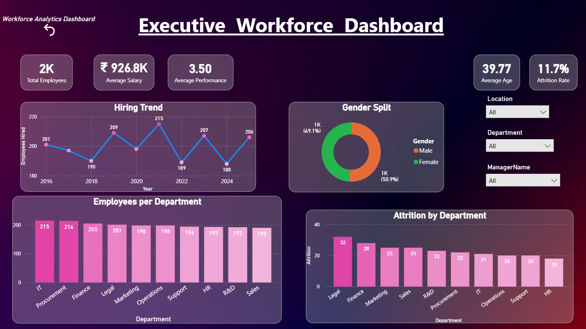
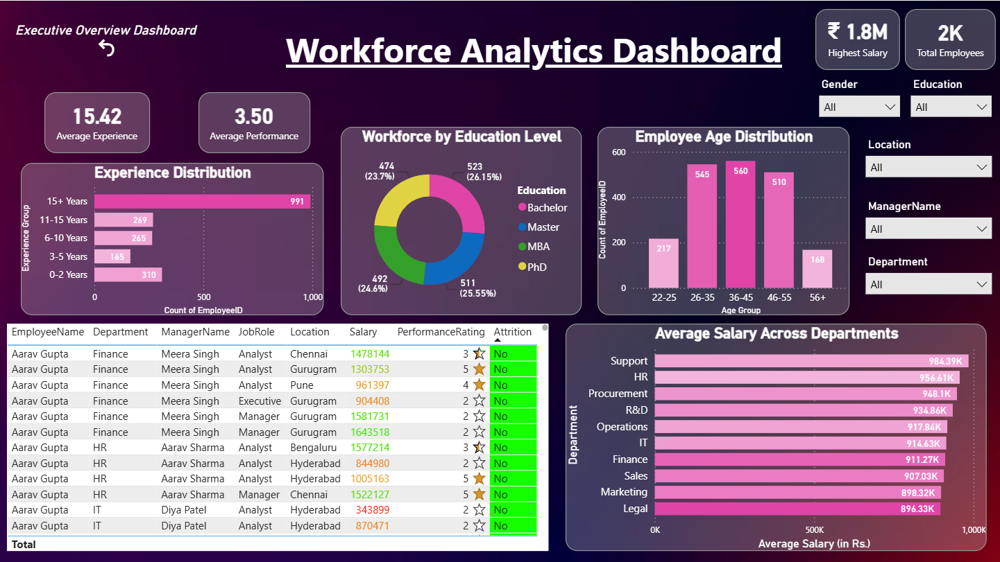
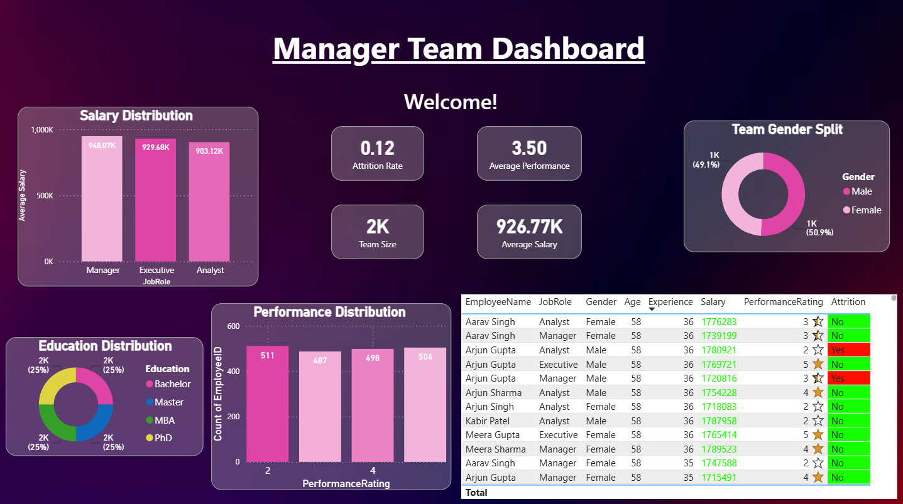

# 📊 HR Workforce Analytics Dashboard (Power BI)

A comprehensive **HR Workforce Analytics Dashboard** built using **Microsoft Power BI** to help executives, HR professionals, and managers monitor workforce metrics, employee performance, salary distribution, hiring trends, and attrition through interactive dashboards.

This project demonstrates **Power Query**, **DAX**, **Data Modeling**, **Row-Level Security (RLS)**, and interactive dashboard design to deliver meaningful business insights from HR data.

---

# 📸 Dashboard Preview

## 👔 Executive Workforce Dashboard



### Highlights

- Executive KPI Cards
- Hiring Trend Analysis
- Gender Distribution
- Employees by Department
- Department-wise Attrition
- Dynamic Filters
- Executive Overview

---

## 👥 Workforce Analytics Dashboard



### Highlights

- Employee Experience Distribution
- Workforce Education Analysis
- Employee Age Distribution
- Department-wise Salary Comparison
- Employee Details Table
- Interactive Filtering

---

## 👨‍💼 Manager Team Dashboard



### Highlights

- Team Performance Metrics
- Salary Distribution
- Team Gender Split
- Education Distribution
- Employee Performance Table
- Team KPIs

---

# 📌 Project Overview

Organizations generate large volumes of HR data but often struggle to transform it into actionable insights.

This dashboard provides a centralized reporting solution that enables decision-makers to monitor workforce health, employee demographics, compensation trends, hiring activities, and attrition patterns through interactive visualizations.

The report supports three different business perspectives:

- Executive Dashboard
- Workforce Dashboard
- Manager Dashboard

---

# 🎯 Business Objectives

The dashboard helps answer questions such as:

- What is the current workforce size?
- How is hiring changing over time?
- Which departments have the highest attrition?
- What is the average salary across departments?
- What is the average employee performance?
- How experienced is the workforce?
- What is the age distribution of employees?
- How is education distributed across the organization?
- How can managers securely view only their own team's data?

---

# 📊 Key KPIs

- 👥 Total Employees
- 💰 Average Salary
- 💰 Highest Salary
- ⭐ Average Performance Rating
- 📈 Average Experience
- 🎂 Average Employee Age
- 📉 Attrition Rate
- 👨‍💼 Team Size

---

# 👔 Executive Dashboard Features

- Hiring Trend Analysis
- Gender Split
- Employees per Department
- Department-wise Attrition
- Department Filter
- Manager Filter
- Location Filter
- Executive KPI Cards

---

# 👥 Workforce Dashboard Features

- Employee Experience Distribution
- Education Level Distribution
- Employee Age Distribution
- Average Salary Across Departments
- Employee Details Table
- Interactive Slicers
- Workforce KPIs

---

# 👨‍💼 Manager Dashboard Features

- Team Salary Distribution
- Team Gender Distribution
- Team Education Distribution
- Employee Performance Distribution
- Employee Details Table
- Team KPI Cards

---

# 🔒 Row-Level Security (RLS)

One of the key features of this project is **Row-Level Security (RLS)**.

Managers can only access data related to employees assigned to them.

This ensures:

- Secure access to employee information
- Role-based dashboard experience
- Better data governance
- Real-world enterprise implementation

---

# ⚙️ Interactive Features

- Multi-page Navigation
- Dynamic Slicers
- Cross Filtering
- Interactive Charts
- KPI Cards
- Responsive Dashboard Layout
- Role-Level Security (RLS)

---

# 📂 Dataset

The project uses an HR dataset containing information such as:

- Employee ID
- Employee Name
- Department
- Job Role
- Manager Name
- Gender
- Age
- Education
- Experience
- Salary
- Performance Rating
- Attrition
- Location
- Hiring Year

---

# 📈 Dashboard Insights

The dashboards provide insights into:

- Workforce composition
- Employee demographics
- Hiring trends over multiple years
- Salary distribution across departments
- Employee performance
- Attrition analysis
- Education levels
- Department-wise workforce allocation
- Manager-level team analytics

---

# 🛠️ Tools & Technologies

- Microsoft Power BI Desktop
- Power Query
- DAX (Data Analysis Expressions)
- Microsoft Excel
- Data Modeling
- Row-Level Security (RLS)

---

# 📊 KPIs Used

- Total Employees
- Average Salary
- Highest Salary
- Average Performance Rating
- Average Experience
- Average Age
- Attrition Rate
- Hiring Count
- Department Employee Count

---

# 🧠 Skills Demonstrated

- Data Cleaning
- Data Transformation
- Power Query
- Data Modeling
- Relationship Management
- DAX Measures
- KPI Design
- Dashboard Design
- HR Analytics
- Business Intelligence
- Interactive Reporting
- Data Storytelling
- Role-Level Security (RLS)

---

# 📁 Repository Contents

```
HR-Workforce-Analytics-with-rls-Dashboard-PowerBI

│── HR Analytics with RLS.pbix
│── HR_Analytics_Dataset.xlsx
│── ExecutiveDashboard.png
│── WorkforceDashboard.png
│── ManagerDashboard.png
│── README.md
```

---

# 🚀 How to Use

1. Clone or download this repository.
2. Open **HR Analytics with RLS.pbix** in Microsoft Power BI Desktop.
3. Load or refresh the dataset if required.
4. Explore the dashboards using the interactive slicers and filters.
5. To test **Row-Level Security**, use **View As Roles** in Power BI Desktop.

---

# 🎓 Learning Outcomes

This project helped strengthen practical knowledge of:

- Power BI Dashboard Development
- Data Modeling
- Power Query
- DAX
- HR Analytics
- Interactive Dashboard Design
- Business Intelligence
- Data Visualization
- Row-Level Security (RLS)
- Business Storytelling

---

⭐ **If you found this project useful, consider giving the repository a star!**
